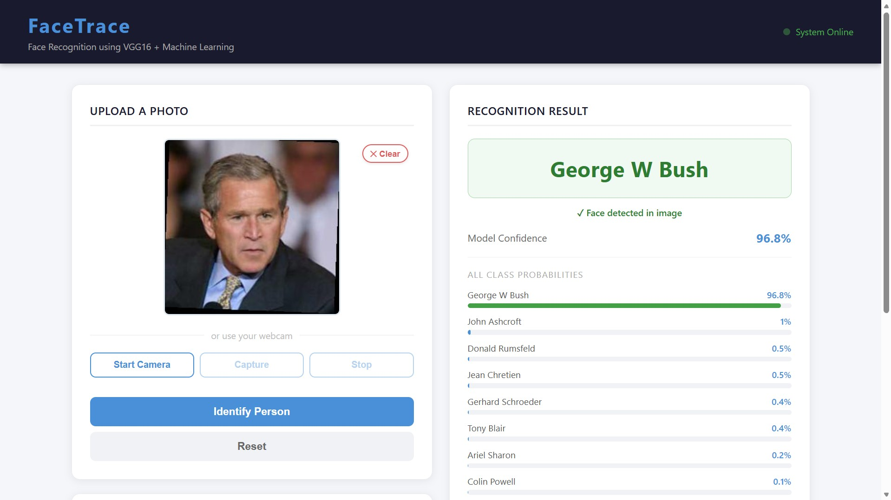

[README.md](https://github.com/user-attachments/files/27246538/README.md)
# FaceTrace — Face Recognition with Pre-Trained Embeddings and Classical Classifiers

<p align="center">
  
  
  
  
  
  
</p>

> **MSc Data Science Capstone Project — University of Roehampton**
> Identifying political figures using frozen VGG16 embeddings and classical ML classifiers, deployed as a Flask web application.

---

## Overview

FaceTrace investigates whether accurate, computationally feasible face recognition can be achieved on **commodity laptop hardware** — no GPU, no proprietary datasets, no industrial training infrastructure.

The pipeline combines a **frozen VGG16 convolutional network** (pre-trained on ImageNet) as a generic feature extractor with four classical classifiers trained on the resulting 512-dimensional embeddings. The best-performing model is deployed as a **Flask REST application** with a browser-based front-end supporting file upload and live webcam capture.

**Central finding:** A regularised Logistic Regression classifier over generic ImageNet features achieves **93.52% macro F1** and **94.52% accuracy** on a held-out test set of 218 images — with no face-specific pre-training, no fine-tuning, and no GPU.

---

## Demo



> The deployed interface shows the predicted identity, model confidence, a face-detected badge, and the full per-class probability distribution.

---

## Features

- **Face detection** using OpenCV's ResNet-10 Single Shot Multibox Detector (SSD)
- **Feature extraction** via frozen VGG16 (ImageNet weights) with Global Average Pooling → 512-d embeddings
- **Head-to-head comparison** of four classifiers under identical conditions: SVM (RBF), k-NN, Random Forest, Logistic Regression
- **Confidence-threshold rejection** — predictions below a calibrated threshold return `"Unknown"` rather than a forced label
- **True open-set evaluation** against 414 genuine impostor samples from outside the enrolled population
- **Flask deployment** with browser UI: drag-and-drop image upload + live webcam capture
- Sub-2-second inference on a standard CPU

---

## Results Summary

### Classifier Comparison (Validation Set)

| Classifier | Macro F1 | Accuracy | Mean AUC |
|---|---|---|---|
| **Logistic Regression** | **0.9264** | **0.9452** | **0.9973** |
| SVM (RBF) | 0.8596 | 0.8904 | 0.9945 |
| k-Nearest Neighbours | 0.7023 | 0.7671 | 0.9038 |
| Random Forest | 0.3772 | 0.5753 | 0.9707 |

### Multi-Seed Stability (5 random seeds)

| Classifier | Mean F1 | Std | Min | Max |
|---|---|---|---|---|
| **Logistic Regression** | **0.9044** | **0.0161** | 0.8828 | 0.9276 |
| SVM (RBF) | 0.8628 | 0.0297 | 0.8115 | 0.8935 |
| k-Nearest Neighbours | 0.6285 | 0.0590 | 0.5528 | 0.7342 |
| Random Forest | 0.4132 | 0.0342 | 0.3591 | 0.4670 |

### Final Held-Out Test Set (Logistic Regression)

| Metric | Value |
|---|---|
| Macro F1 | **0.9352** |
| Accuracy | **94.52%** |
| True Open-Set EER | 25.97% @ threshold 0.829 |
| Inference latency | ~1.2 ms / query |

---

## Dataset

The [Labeled Faces in the Wild (LFW)](https://www.kaggle.com/datasets/jessicali9530/lfw-dataset) dataset was curated to the **10 highest-frequency identities** (1,457 images total), split 70/15/15 (train/val/test) with stratification.

| Identity | Images | Train | Val | Test |
|---|---|---|---|---|
| George W. Bush | 530 | 371 | 80 | 79 |
| Colin Powell | 236 | 165 | 35 | 36 |
| Tony Blair | 144 | 101 | 21 | 22 |
| Donald Rumsfeld | 121 | 85 | 18 | 18 |
| Gerhard Schroeder | 109 | 76 | 16 | 17 |
| Ariel Sharon | 77 | 54 | 12 | 11 |
| Hugo Chavez | 71 | 50 | 11 | 10 |
| Junichiro Koizumi | 60 | 42 | 9 | 9 |
| Jean Chretien | 55 | 39 | 8 | 8 |
| John Ashcroft | 53 | 37 | 8 | 8 |
| **Total** | **1,457** | **1,018** | **218** | **218** |

An **impostor set** of 10 additional LFW identities (414 images) was constructed for true open-set evaluation.

---

## Pipeline

```
Phase 1          Phase 2          Phase 3          Phase 4              Phase 5
Data Curation ──► Face Detection ──► VGG16 Frozen ──► Classifier Tuning ──► Flask Deploy
& Splitting       (ResNet-10 SSD)    Embeddings        (GridSearchCV)        & Browser UI
```

1. **Data Curation** — Select top-10 LFW identities, apply stratified 70/15/15 split with class weighting
2. **Face Detection** — OpenCV DNN ResNet-10 SSD; crop at native resolution, fallback to full image
3. **Embedding Extraction** — Frozen VGG16 → GlobalAveragePooling2D → 512-d vector, cached to disk
4. **Classifier Training** — 5-fold stratified GridSearchCV, `class_weight='balanced'`, macro F1 scoring
5. **Deployment** — Flask REST API + vanilla HTML/CSS/JS browser front-end

---

## Repository Structure

```
FaceTrace/
├── server.py                          # Flask REST server (routes: /, /predict, /classes)
├── util.py                            # Shared utility: face detection, embedding, inference
├── FaceTrace_Simple_v2.ipynb          # Training, evaluation and analysis notebook
├── artifacts/
│   ├── saved_model.pkl                # Trained Logistic Regression classifier
│   ├── class_dictionary.json          # Name → index mapping
│   ├── deploy.prototxt                # OpenCV DNN face detector config
│   └── res10_300x300_ssd_iter_140000.caffemodel  # DNN detector weights
├── templates/
│   └── app.html                       # Jinja2 browser front-end template
└── static/
    ├── app.css                        # Stylesheet
    └── app.js                         # Client-side JS: upload, webcam, API calls
```

---

## Getting Started

### Prerequisites

- Python 3.9+
- Standard laptop CPU (no GPU required)

### Installation

```bash
git clone https://github.com/joelthankachan/FaceTrace.git
cd FaceTrace
pip install flask tensorflow keras scikit-learn opencv-python joblib numpy
```

### Dataset Setup

Download the LFW dataset from [Kaggle](https://www.kaggle.com/datasets/jessicali9530/lfw-dataset) and organise it as follows:

```
Dataset/
├── enrolled/
│   ├── Ariel_Sharon/
│   ├── Colin_Powell/
│   ├── Donald_Rumsfeld/
│   ├── George_W_Bush/
│   ├── Gerhard_Schroeder/
│   ├── Hugo_Chavez/
│   ├── Jean_Chretien/
│   ├── John_Ashcroft/
│   ├── Junichiro_Koizumi/
│   └── Tony_Blair/
└── impostors/
    └── (10 additional LFW identities for open-set evaluation)
```

### Train the Model

Open and run all cells in `FaceTrace_Simple_v2.ipynb`. The notebook will:

1. Load and explore the dataset
2. Detect faces and extract VGG16 embeddings (cached to `face_embeddings.npz` after first run)
3. Apply the 70/15/15 stratified split
4. Train all four classifiers with GridSearchCV (5-fold CV, macro F1 scoring)
5. Plot confusion matrices, ROC curves, and FAR/FRR sweep
6. Save the best classifier to `artifacts/saved_model.pkl`

> **Note:** Embeddings are cached after the first extraction run. Subsequent runs load from disk in under a second.

### Run the Application

```bash
python server.py
```

Navigate to `http://127.0.0.1:5000` in your browser. Upload a face image or use webcam capture — the system returns the predicted identity, confidence score, and full per-class probability breakdown.

Predictions below the **0.829 confidence threshold** (derived from the true open-set EER) are returned as `"Unknown"`.

---

## Key Design Decisions

**Why VGG16 (ImageNet) instead of VGGFace?**
The original scope planned to use VGGFace, but a package compatibility conflict with `keras-vggface` led to substituting standard VGG16 with ImageNet weights. This turned out to *strengthen* the project's argument: achieving 93.52% macro F1 using features never trained on faces is a more compelling feasibility statement than the same result with face-optimised features.

**Why Logistic Regression wins**
VGG16 ImageNet embeddings are approximately linearly separable for the ten enrolled identities — precisely the condition where a regularised linear model excels. The result is also the fastest at inference (~1.2 ms/query), requiring only a single matrix-vector multiplication.

**Why Random Forest collapses**
Axis-aligned splits in high-dimensional continuous embedding spaces struggle to exploit directions that are linear combinations of many features. The model achieves reasonable AUC (0.9707) but poorly calibrated probabilities, which devastates its macro F1.

**Confidence-threshold rejection**
A naive closed-set classifier always returns one of its ten labels. The threshold rejection rule ensures faces outside the enrolled population receive an explicit `"Unknown"` response rather than a forced — and likely wrong — identity.

---

## Tech Stack

| Component | Choice | Rationale |
|---|---|---|
| Language | Python 3.10 | Dominant ML ecosystem |
| Deep learning | TensorFlow / Keras | VGG16 + ImageNet weights in `keras.applications` |
| Face detection | OpenCV DNN (ResNet-10 SSD) | More robust than Haar Cascades under pose/lighting variation |
| Classical ML | scikit-learn | Unified API, GridSearchCV, metrics module |
| Web framework | Flask | Minimal WSGI; ideal for a single-purpose REST API |
| Front-end | Vanilla HTML/CSS/JS | No build toolchain required |
| Persistence | Joblib + NumPy | Fast serialisation of estimators and embeddings |

---

## Ethical Considerations

- The LFW dataset is a publicly released academic benchmark containing only public figures from news photographs, used under its open research licence
- No images were scraped from any website; no personal data outside LFW was used at any stage
- LFW is known to over-represent Western male public figures — demographic bias is acknowledged and per-class performance is reported transparently
- This system is an **academic proof-of-concept** and must not be connected to any surveillance or law-enforcement application

---

## Future Work

- Substitute the ImageNet backbone with a face-specific network (VGGFace2, ArcFace) and re-run the same classifier comparison
- Scale the enrolled set beyond 10 identities to test how classifier ranking shifts at larger enrolment sizes
- Add a dedicated impostor test set for strict biometric FAR evaluation
- Containerise with Docker and front with Gunicorn for production-ready deployment
- Apply McNemar's test across more random seeds for formal statistical significance in the classifier comparison

---

## References

Key references (full list in the project report):

- Simonyan & Zisserman — [VGG16](https://arxiv.org/abs/1409.1556) (2015)
- Huang et al. — [Labeled Faces in the Wild](http://vis-www.cs.umass.edu/lfw/) (2007)
- Pedregosa et al. — [scikit-learn](https://www.jmlr.org/papers/v12/pedregosa11a.html) (2011)
- Deng et al. — [ArcFace](https://doi.org/10.1109/CVPR.2019.00482) (2019)
- Yosinski et al. — [How Transferable are Features in Deep Neural Networks?](https://papers.nips.cc/paper/2014) (2014)

---

## Author

**Joel Thankachan** — MSc Data Science, University of Roehampton  
Supervised by Mohammad Javaheri  
Submitted: April 2026

---

<p align="center"><i>FaceTrace is an academic proof-of-concept. It is not intended for production use in any identification, surveillance, or law-enforcement context.</i></p>
